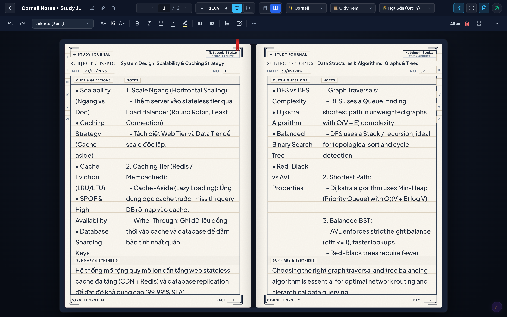

# 📓 Notebook Studio

> **Sổ tay ghi chép số cá nhân cao cấp mô phỏng sổ thật trên bàn làm việc (A4 Real-Feel Desk Spread)** — Hỗ trợ các mẫu trang kinh điển quốc tế (**Cornell Notes**, **Work & Project Log**, **Ruled Classic**), lật trang 3D chân thực, dải lụa đỏ chuyển trang thông minh, định dạng văn bản linh hoạt và tích hợp trợ lý AI Co-pilot.

---

<p align="center">
  
</p>

---

## ✨ Tính Năng Nổi Bật

- 📖 **Trải nghiệm A4 Desk Spread chân thực**:
  - Mô phỏng cuốn sổ thực mở 2 trang song song hoặc 1 trang đơn trên mặt bàn gỗ tối giản.
  - Hiệu ứng lật trang 3D mượt mà 60fps với độ cong giấy và đổ bóng chiều sâu.
  - **Dải lụa đỏ chuyển trang**: Bấm dải lụa để chuyển nhanh con trỏ soạn thảo giữa trang Trái và Phải.
  - **Thu phóng tự do**: Zoom mượt từ 30% đến 350%, hỗ trợ chế độ **Fit Page** (vừa chiều cao) và **Fit Width** (vừa chiều rộng).

- 📄 **Ba mẫu trang tiêu chuẩn quốc tế**:
  - **Cornell Notes**: Cột từ khóa (*Cues & Questions*), vùng ghi chú chính (*Notes*), khung tóm tắt cô đọng (*Summary & Synthesis*).
  - **Work & Project Log**: Mục tiêu dự án, hạn chót, huy hiệu trạng thái (*TODO / WIP / DONE*), hai cột thảo luận và danh sách việc cần làm (*Action Items Checklist*).
  - **Ruled Classic & Freeform**: Mặt giấy kẻ ngang truyền thống hỗ trợ ghi chép tự do, nhật ký cá nhân.

- 🖋️ **Soạn thảo & Định dạng văn bản phong phú**:
  - Đậm (`Bold`), Nghiêng (`Italic`), Gạch chân (`Underline`), Gạch ngang (`Strike`), Huy hiệu viền tròn (`Badge`).
  - Đổi phông chữ linh hoạt theo từng đoạn văn bản được chọn (**Jakarta Sans**, **Cormorant Serif**, **JetBrains Mono**, **Kaiti Thư pháp**,...).
  - Bảng chọn màu chữ và màu nền highlight pastel tinh tế.
  - Tiêu đề H1/H2/H3, danh sách dấu chấm, đánh số, checkbox Todo, khối mã code, trích dẫn.

- 🤖 **AI Co-pilot thông minh**:
  - Trợ lý AI hỗ trợ viết tiếp, sửa ngữ pháp, tóm tắt, dịch thuật hoặc tự động điền mẫu trang.
  - Cấu hình linh hoạt: Tùy biến **API Base URL** (OpenAI, OpenRouter, DeepSeek, Groq, Ollama local,...), **API Key cá nhân**, và nhập bất kỳ **Model ID** tùy ý.

- 🖨️ **Xuất PDF & In ấn chuẩn Vector**:
  - Tự động sinh trang bìa hoàng gia A4 cổ điển sang trọng kèm mục lục và thông tin tác giả.
  - Xuất in định dạng `@media print` vector sắc nét, hỗ trợ in toàn bộ sổ hoặc từng trang.

- 🔄 **Đồng bộ hóa & Lưu trữ an toàn**:
  - Lưu tự động tức thì vào cơ sở dữ liệu với cơ chế chống xung đột, chống ghi đè dữ liệu giữa các thiết bị.
  - Hỗ trợ cài đặt PWA và hoạt động Offline qua Service Worker.

---

## 🚀 Cài Đặt & Khởi Chạy

### Cách 1: Cài đặt tự động một dòng lệnh (Khuyên dùng)

```bash
curl -fsSL "https://github.com/thaonv7995/notebook/releases/latest/download/install.sh" | bash -s -- "thaonv7995/notebook"
```

> **Cập nhật lên bản mới nhất:**
> ```bash
> curl -fsSL "https://github.com/thaonv7995/notebook/releases/latest/download/install.sh" | bash -s -- "thaonv7995/notebook" update
> ```
> *(Dữ liệu, mật khẩu và file `.env` được bảo toàn nguyên vẹn khi cập nhật)*

---

### Cách 2: Cài đặt thủ công (Dành cho nhà phát triển)

```bash
# 1. Clone mã nguồn
git clone https://github.com/thaonv7995/notebook.git
cd notebook

# 2. Cài đặt thư viện
npm install

# 3. Tạo cấu hình môi trường .env
cp .env.example .env

# 4. Build và khởi chạy
npm run build
npm start
```

Mở trình duyệt truy cập: `http://localhost:27972`

- **Chạy môi trường phát triển (Dev Mode)**:
  ```bash
  npm run dev
  ```
  *(Chạy song song Express Backend port 27972 và Vite HMR port 27973)*

---

## ⌨️ Phím Tắt Thường Dùng

| Phím tắt | Thao tác |
| :--- | :--- |
| `Ctrl/Cmd + S` | Lưu tức thì dữ liệu trang hiện tại |
| `Ctrl/Cmd + \` | Thu gọn / Mở rộng thanh công cụ định dạng |
| `F11` hoặc `Alt + Enter` | Bật / Tắt chế độ toàn màn hình không xao nhãng |
| `Ctrl/Cmd + B / I / U` | In đậm / In nghiêng / Gạch chân chữ đang chọn |
| `Ctrl/Cmd + =` / `-` | Phóng to / Thu nhỏ bàn làm việc |
| `Ctrl/Cmd + 0` | Trả về tỷ lệ thu phóng chuẩn 100% |
| `Ctrl + Con lăn chuột` | Zoom tự do theo vị trí trỏ chuột |
| `Mũi tên Trái / Phải` | Lật trang Lùi / Tiến |
| `Dải lụa đỏ` | Chuyển đổi con trỏ nhanh giữa trang Trái và Phải |
| `Escape` | Đóng menu nổi, popup Cài đặt AI hoặc thoát toàn màn hình |

---

## 📜 Giấy Phép & Bản Quyền

Dự án được xây dựng và tối ưu bởi **Thao NV** • Bản quyền © 2026 Notebook Studio. Mọi quyền được bảo lưu.
